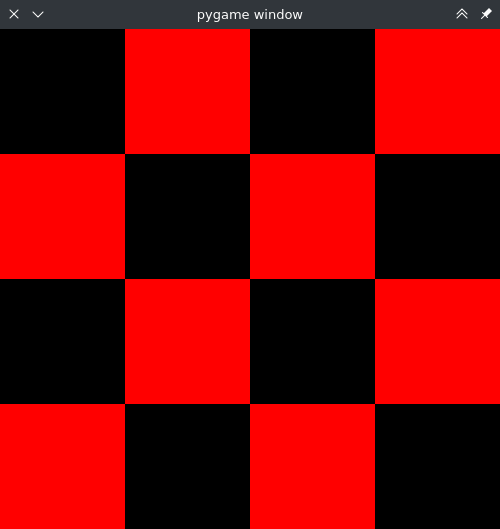
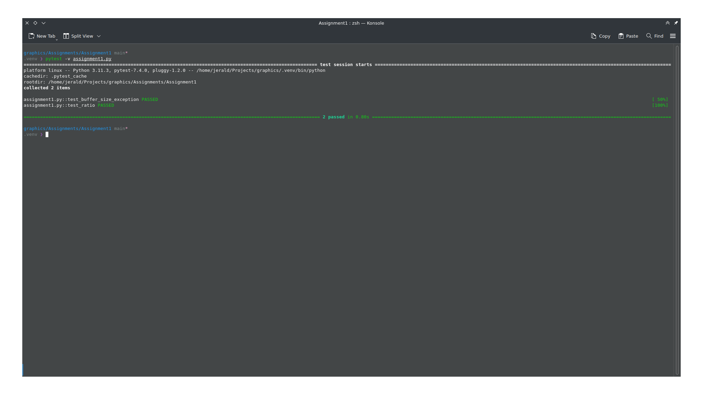

# Programming Assignment 1

Class: COMPSCI 459(G), Fall 2023

Professor: Jerald Thomas

## Overview

In this programming assignment, you are going to complete the first step towards building our renderer: the screen module. As discussed in class, our renderer is going to be composed of several independent modules. The screen module is responsible displaying the result of a render. Specifically, it will provide a class called `Screen` that can take a 2D array of color values and display them on the computer's screen. Please read the entire document before starting the assignment.


## Instructions

For this assignment, you will create a python file called `screen.py`, and within that file there will be a class called `Screen`. `Screen` needs to be implemented as detailed below. Getting a bunch of numbers to display on a computer monitor as colors can be a complicated task. For this class, we are going to make use of the PyGame project, which nicely provides a simple way to accomplish this. To use PyGame, you must first have the `pygame` package installed (see below). [This example](https://realpython.com/pygame-a-primer/#basic-pygame-program) and the documentation for the [`array_to_surface`](https://www.pygame.org/docs/ref/pixelcopy.html#pygame.pixelcopy.array_to_surface) method should give you enough to implement what is needed.

### Output

The following should be the output when `assignment1.py` is run:

```bash
python assignment1.py
```



The following should be the output when pytest with the verbose flag is run:

```bash
pytest -v assignment1.py
```



### Dependency Management
Each assignment will include a requirements.txt file that includes the python package requirements for the assignment. If you are using PyCharm it should automatically detect and install the dependencies when you create the virtual environment. Otherwise, [these instructions](https://www.jetbrains.com/help/pycharm/managing-dependencies.html#configure-requirements) will help you manually manage the requirements in PyCharm. If you are using something other than PyCharm, you can use the command line to manually install the packages from the requirements.txt file:

```bash
pip install -r requriements.txt
```

## The Screen Class

### Exposed Members
There are no required exposed members. However, you should still create members to store information that will be needed for the correct operation of the class.

### Exposed Methods

#### `__init__(self, width, height)`
The constructor takes two integers as arguments: width and height. These two arguments define the size and shape of the resulting image.

#### `ratio(self)`
This method simply returns a float that is the ratio of the screen's width to height. That is, if the screen width is 100px and the screen height is 50px, then this method would return `2.0`.

#### `draw(self, buffer)`
This method takes a buffer of color values. The buffer should be a 3-dimensional numpy array with shape `(width, height, 3)`, where width and height are specified in the `__init__` call. The value `3` is because there are three values for each color (red, blue, and green). An exception should be thrown if the incoming buffer is of a different shape. You should somehow transfer the values in the incoming buffer array to a pygame instance.

#### `show(self)`
This method enters the main event loop and prevents the window from closing right away. The window should close when the pygame.QUIT event is triggered.

## Extra Credit
If you wish to receive the 1 extra credit point, you can create a program that uses the `Screen` class to draw a triangle to the screen. This should be done in a separate file called `extracredit.py`. You must use the `Screen` class and the methods you implemented earlier (except the `ratio` method). When run with python, `extracredit.py` should show a pygame window with a single color background, and a different single color triangle. The square bounds of the triangle must be more than 50px by 50px, and it must be entirely contained in the generated image. Everything else, the color, position, orientation, size, etc. are all up to you. This is something that you will need to implement in future assignments, so it would behoove you to figure it out now.

## Rubric
There are 10 points (11 with extra credit) for this assignment:

- *2 pts*: pytest test_buffer_size_exception passed
- *2 pts*: pytest test_ratio passed
- *6 pts*: running `assignment1.py` produces the correct output (as described above)
  + 2 pts for spawning a pygame window
  + 4 pts for the window containing the correct checker pattern
